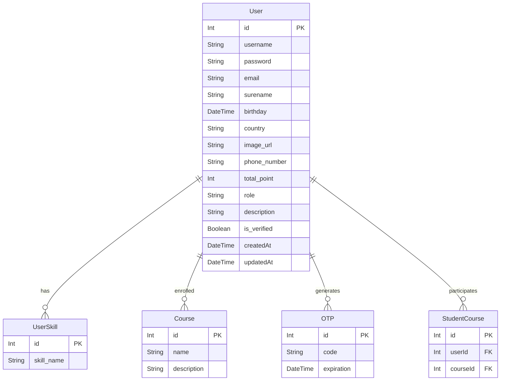

# Project Documentation

## About

EZCOURSE is an online platform for programming courses that aims to make quality education accessible to everyone, especially students. It offers structured learning materials and interactive features, allowing users to engage actively in their education. Users can also create and upload their own courses, promoting a collaborative learning community. The platform seeks to provide affordable and relevant solutions for diverse learners, enhancing access to programming knowledge.

## Overview

This project uses a monorepo structure managed by **pnpm workspace**. It contains both frontend and backend applications, as well as shared packages for common functionality. The project leverages modern technologies for efficient development and performance.

---

## Folder Structure

```
root
├── apps
│   ├── frontend
│   └── backend
├── packages
│   └── common
├── .husky
├── .prettierrc
├── .eslintrc.js
├── commitlint.config.js
```

### Apps

- **Frontend**: Built with React, Tailwind CSS, Axios, Tanstack Query, and Zustand.
- **Backend**: Built with Express.js, MySQL, Prisma, Joi, and JSON Web Tokens (JWT).

### Packages

- **Common**: Contains shared logic and data used by both frontend and backend.

---

## Frontend

### Technologies Used

- **React**: UI library.
- **Tailwind CSS**: Utility-first CSS framework.
- **Axios**: HTTP client.
- **Tanstack Query**: For asynchronous state management.
- **Zustand**: For local state management.

## Backend

### Technologies Used

- **Express.js**: Web framework.
- **MySQL**: Relational database.
- **Prisma**: ORM.
- **Joi**: Schema validation.
- **JWT**: Authentication.

---

## Shared Packages

### Common

This package contains shared logic and utilities used by both the frontend and backend applications.

---

## Setup Project

1. Install all dependencies:
   ```bash
   pnpm install
   ```
2. Rename all `.env` file into

- `.env.example` to `.env`
- `.env.development.example` to `.env.development`
- `.env.production.example` to `.env.production`

3. Replace all `env` variabels with your local config
4. Install `dotenv-cli` as global package
   ```bash
   pnpm add -g dotenv-cli
   ```
5. Build common packages
   ```bash
   pnpm common:build
   ```
6. Create new folder at

- **/apps/backend/src/uploads/photos**
- **/apps/backend/src/uploads/videos**

7. Run Prisma migrations:
   ```bash
   pnpm backend migrate
   ```
8. Run backend server:
   ```bash
   pnpm backend dev
   ```
9. Run frontend server:
   ```bash
   pnpm frontend dev
   ```
10. make sure your API and CLIENT apps run with the same port from env config

---

## Database Diagram

Below is the database diagram represented using **Mermaid**:



---

## Additional Resources

- **Mailtrap Setup**: [Tutorial Video](https://youtu.be/Wa9KDiB7C_I?si=3jX6VfebeE2cflzH)

---

## Contribution

Feel free to fork this repository and submit pull requests. For major changes, please open an issue first to discuss what you would like to change.

---

## License

This project is licensed under the ISC License. See the LICENSE file for details.
